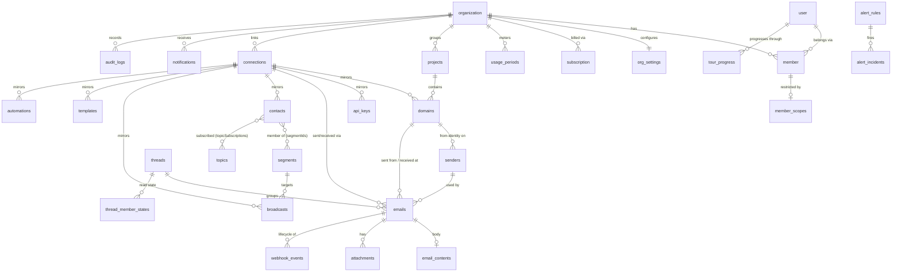

# DBD — Mailwise (Database Design)

> **Status:** Draft v0.1, 2026-09-29
> **Database:** MongoDB Atlas, Mongoose ODM
> **Related:** `TRD.md`, `UCD.md`

---

## 1. Modeling rules

1. **Tenant-scoped.** Every application collection has `orgId: ObjectId` (ref `organization`), required and immutable. Every compound index starts with `orgId`. Repositories inject `orgId` from the session; it is never accepted from client input.
2. **References over embedding.** Relationships are stored as `ObjectId` refs (foreign keys) and resolved with a second query or `$lookup`. Embedding is allowed only for data that is bounded, owned exclusively by the parent, and always read with it (e.g. DNS records inside a domain, variables inside a template).
3. **Allowed denormalization** is limited to cached display values that are cheap to recompute, marked *(cache)* in the field tables — e.g. a thread's `lastMessageAt` and `snippet`. The source of truth is always the referenced document.
4. **Mirrors of Resend objects** (domains, API keys, contacts, segments, topics, templates, broadcasts, automations, emails) store `resendId` (string, Resend's UUID) and `connectionId`. Unique key: `(connectionId, resendId)`.
5. **Heavy payloads are split out.** List-view documents stay small; bodies, raw MIME, and raw webhook payloads live in separate collections or Blob storage.
6. **Timestamps.** All collections use Mongoose `timestamps: true` (`createdAt`, `updatedAt`) unless noted. Times are UTC.
7. **Soft delete** only where history matters (`connections`, `projects`, `senders`): `deletedAt: Date | null`. Everything else is hard-deleted.
8. **Retention** via `expireAt: Date` with a TTL index (`expireAfterSeconds: 0`), set per document from the org's plan.
9. **Secrets** are stored as an `EncryptedValue` sub-document: `{ ciphertext: string, iv: string, tag: string, wrappedDek: string, kekId: string }`, plus a plain `last4` for display.
10. **Typed references.** In code every reference uses a branded type (`Id<"domains">`, `Id<"threads">`, …) so the compiler rejects an id of the wrong collection. MongoDB has no foreign keys: services check that a referenced document exists in the same org before writing (`assertRefs`), delete behavior follows §5, and a nightly job reports dangling references.
11. **Transactions.** Atlas runs as a replica set; any write touching more than one document runs in a multi-document transaction (`TRD.md` §2.12). User-edited documents (drafts, alert rules, templates, senders, projects) carry a Mongoose version key with optimistic concurrency.
12. **Realtime events.** Every write that changes user-visible data also inserts a `realtime_events` document in the same transaction (§4.9); clients never watch business collections directly.

## 2. Collections overview

| Group | Collection | Owner | Purpose |
|---|---|---|---|
| Auth (Better Auth) | `user`, `session`, `account`, `verification` | Better Auth | Identity and sessions |
| Tenancy (Better Auth org plugin) | `organization`, `member`, `invitation` | Better Auth | Orgs, membership, roles |
| Tenancy | `org_settings` | App | Plan, limits, AI and retention settings |
| Tenancy | `member_scopes` | App | Project restrictions per member |
| Tenancy | `projects` | App | Logical grouping of domains |
| Resend | `connections` | App | Linked Resend accounts |
| Resend mirror | `domains`, `api_keys`, `templates`, `automations` | Sync | Mirrors of Resend objects |
| Sending | `senders`, `drafts` | App | From-identities, unsent compositions |
| Mail | `emails`, `email_contents`, `attachments`, `threads`, `thread_member_states`, `labels` | App + ingest | Sent and received messages |
| Events | `webhook_events` | Ingest | Raw, immutable Resend events |
| Audience mirror | `contacts`, `segments`, `topics`, `contact_properties`, `broadcasts` | Sync | Marketing objects |
| Insights | `metric_rollups` | Jobs | Pre-aggregated counters |
| Alerts | `alert_rules`, `alert_incidents` | App + jobs | Rules and firings |
| Notifications | `notifications`, `notification_preferences` | Jobs + App | In-app feed, channel preferences |
| AI | `ai_usage` | App | Token and credit metering |
| Ops | `sync_runs`, `audit_logs`, `usage_periods` | Jobs + App | Sync checkpoints, audit trail, billing usage |
| Onboarding | `tour_progress` | App | Product tour completion per user |
| Realtime | `realtime_events` | App + jobs | Short-lived change notifications for live UI |
| Billing (Better Auth Stripe plugin) | `subscription` | Better Auth | Stripe subscription state per organization |

## 3. Relationships



## 4. Field definitions

Notation: **R** = required, **U** = unique (within stated scope), **I** = indexed. All app collections have `_id: ObjectId`, `orgId: ObjectId (R, ref organization)`, `createdAt`, `updatedAt` unless noted; these are omitted from the tables.

### 4.1 Tenancy

Better Auth collections (`user`, `session`, `account`, `verification`, `organization`, `member`, `invitation`) follow Better Auth's schema. The org plugin adds `activeOrganizationId` to `session`. `member.role` holds one of `owner | admin | developer | support | viewer` (custom access-control roles). ID type of Better Auth documents to be confirmed against the MongoDB adapter during setup; app refs use the same type.

**`org_settings`** — one per organization (`orgId` U)

| Field | Type | Notes |
|---|---|---|
| plan | enum `free \| pro \| team \| agency` | R, I. Limits and features come from the plan catalog in code (`lib/billing/plans.ts`), not from this document |
| planState | enum `trialing \| active \| past_due \| canceling \| free` | R |
| trial | `{ startedAt: Date, endsAt: Date } \| null` | App-side 14-day Pro trial (no card) |
| limitOverrides | `{ connections?, members?, projects?, alertRules?, emailsTrackedPerMonth?, retentionDays?, aiCreditsPerMonth?: number }` | Optional per-org exceptions (sales deals, support); merged over the catalog |
| billingPeriod | `{ start: Date, end: Date }` | R; Stripe period for paid plans, calendar month otherwise |
| billingInterval | enum `month \| year` \| null | |
| extraConnections | number | Agency only; billed quantity = `max(0, activeConnections − 15)` |
| aiCredits | `{ periodAllowance: number, periodUsed: number, reserved: number, packBalance: number, packExpiresAt?: Date }` | Allowance resets each period; packs used after the allowance; `packExpiresAt` set 90 days after moving to Free |
| grace | `{ overAllowanceSince?: Date, pastDueSince?: Date }` | Starts the 7-day allowance grace (Free) and 14-day payment grace |
| pendingChange | `{ toPlan: string, effectiveAt: Date, retentionEffectiveAt?: Date } \| null` | Scheduled downgrade and retention notice |
| stripeCustomerId | string | Links to Better Auth's `subscription` collection (`referenceId` = orgId) |
| timezone | string (IANA) | R, default `UTC`; used for rollup days and digests |
| ai | `{ enabled: boolean, features: { triage: boolean, drafts: boolean, compose: boolean, anomalies: boolean } }` | Org preference; effective only if the plan includes AI |
| deletedAt | Date \| null | Org soft delete |

The Better Auth Stripe plugin adds a `subscription` collection (plan, status, Stripe ids, period, trial, `cancelAtPeriodEnd`, `seats`, `billingInterval`); `org_settings` holds only what the app needs beyond it.

**`member_scopes`** — present only for project-restricted members

| Field | Type | Notes |
|---|---|---|
| memberId | ObjectId → `member` | R, U (`orgId`, `memberId`) |
| projectIds | ObjectId[] → `projects` | R, non-empty |

**`projects`**

| Field | Type | Notes |
|---|---|---|
| name | string | R, U (`orgId`, `name`) among non-deleted |
| slug | string | R, U (`orgId`, `slug`) |
| color | string | R, token name from palette |
| description | string | |
| deletedAt | Date \| null | |

Domains reference their project (`domains.projectId`); the project does not store a domain list, so one domain belongs to at most one project by construction.

### 4.2 Connections & Resend mirrors

**`connections`**

| Field | Type | Notes |
|---|---|---|
| name | string | R, U (`orgId`, `name`) |
| provider | enum `resend` | R, default `resend`; future providers |
| apiKey | EncryptedValue | R |
| apiKeyLast4 | string | R |
| resendTeamFingerprint | string | R, U (`orgId`, value); hash identifying the Resend team, prevents double-connect |
| webhook | `{ resendId: string, signingSecret: EncryptedValue, events: string[], registeredAt: Date }` | R once active |
| status | enum `provisioning \| active \| needs_attention \| read_only \| disabled` | R, I. `read_only`: over the plan's connection limit after a downgrade; events still ingested, sending and management disabled |
| statusReason | string | e.g. `key_revoked`, `webhook_slot_unavailable`, `over_plan_limit` |
| lastEventAt | Date | *(cache)* for silence detection |
| lastSyncAt | Date | |
| planQuota | `{ transactional?: { monthlyEmails?: number, dailyEmails?: number }, marketing?: { contacts?: number } }` | User-entered Resend plan quotas; Resend sells transactional (emails/month) and marketing (contacts) plans separately and the API exposes neither |
| checklist | `{ key: string, status: 'ok' \| 'warn' \| 'fail', checkedAt: Date }[]` | Bounded (≤ 10) |
| createdBy | ObjectId → `user` | R |
| deletedAt | Date \| null | |

**`domains`**

| Field | Type | Notes |
|---|---|---|
| connectionId | ObjectId → `connections` | R |
| resendId | string | R, U (`connectionId`, `resendId`) |
| projectId | ObjectId → `projects` \| null | I (`orgId`, `projectId`) |
| name | string | R, I (`orgId`, `name`) |
| status | enum `not_started \| pending \| verified \| partially_verified \| failed \| temporary_failure` | R |
| region | string | |
| openTracking | boolean | |
| clickTracking | boolean | |
| receiving | `{ enabled: boolean, mxVerified: boolean }` | |
| records | `{ record: string, type: string, name: string, value: string, priority?: number, status: string }[]` | Embedded, bounded |
| dnsCheck | `{ checkedAt: Date, spf: string, dkim: string, dmarc: string, mx: string }` | Our own periodic check |

**`api_keys`** (metadata only; the key itself is never stored)

| Field | Type | Notes |
|---|---|---|
| connectionId | ObjectId → `connections` | R |
| resendId | string | R, U (`connectionId`, `resendId`) |
| name | string | R |
| permission | enum `full_access \| sending_access` | |
| domainId | ObjectId → `domains` \| null | Restricted domain |
| resendCreatedAt | Date | |
| createdViaApp | boolean | Created through our UI |
| createdBy | ObjectId → `user` \| null | |

**`templates`**

| Field | Type | Notes |
|---|---|---|
| connectionId | ObjectId | R |
| resendId | string | R, U (`connectionId`, `resendId`) |
| name | string | R |
| alias | string | |
| subject | string | |
| from | string | |
| html | string | |
| text | string | |
| variables | `{ key: string, type: string, fallback?: string }[]` | Embedded |
| status | enum `draft \| published` | |

**`automations`**

| Field | Type | Notes |
|---|---|---|
| connectionId | ObjectId | R |
| resendId | string | R, U (`connectionId`, `resendId`) |
| name | string | R |
| status | enum `enabled \| disabled` | |
| steps | `{ key: string, type: string, config: object }[]` | Embedded as returned by Resend |
| connections | `{ from: string, to: string }[]` | Step graph edges |

### 4.3 Sending

**`senders`**

| Field | Type | Notes |
|---|---|---|
| domainId | ObjectId → `domains` | R |
| localPart | string | R, lowercase |
| address | string | R, U (`orgId`, `address`); `localPart@domain` *(cache)* |
| displayName | string | |
| replyTo | string[] | |
| signatureHtml | string | |
| isDefault | boolean | One default per domain |
| status | enum `active \| domain_unverified \| connection_inactive \| disabled` | R, I (`orgId`, `status`). Derived from the domain and connection (see below); `disabled` is set only by a member |
| statusReason | string | e.g. `domain_deleted_in_resend`, `domain_failed`, `resend_rejected_domain`, `key_revoked`, `connection_read_only` |
| statusChangedAt | Date | |
| canReceiveReplies | boolean | *(cache)* `domains.receiving.enabled` of this sender's domain, or of its `replyTo` domain when set |
| deletedAt | Date \| null | |

Sender status is recomputed whenever its domain or connection changes (`domain.updated` / `domain.deleted` webhooks, domain sync, scheduled DNS check, connection status change, a send rejected by Resend for the domain). Only `active` senders can send. A sender returns to `active` automatically when the cause clears, unless a member set `disabled`.

**`drafts`**

| Field | Type | Notes |
|---|---|---|
| userId | ObjectId → `user` | R, I (`orgId`, `userId`) |
| senderId | ObjectId → `senders` | |
| threadId | ObjectId → `threads` | When replying |
| inReplyToEmailId | ObjectId → `emails` | |
| to, cc, bcc | string[] | |
| subject | string | |
| mode | enum `rich \| html \| template` | |
| bodyHtml, bodyText | string | |
| templateId | ObjectId → `templates` | |
| templateVariables | object | |
| attachmentIds | ObjectId[] → `attachments` | Uploaded, not yet sent |
| scheduledAt | Date | |

### 4.4 Mail

**`emails`** — one document per message, both directions. List views read only this collection.

| Field | Type | Notes |
|---|---|---|
| connectionId | ObjectId → `connections` | R |
| resendId | string \| null | U (`connectionId`, `resendId`) sparse; null until Resend accepts an outbound send |
| direction | enum `outbound \| inbound` | R |
| origin | enum `app \| external \| broadcast` | Outbound: composed here, sent by user's own app, or broadcast |
| domainId | ObjectId → `domains` | Sending domain (outbound) or receiving domain (inbound) |
| projectId | ObjectId → `projects` \| null | Resolved from domain at creation; I |
| senderId | ObjectId → `senders` \| null | Outbound from app |
| threadId | ObjectId → `threads` \| null | Inbound, and outbound replies |
| broadcastId | ObjectId → `broadcasts` \| null | |
| templateId | ObjectId → `templates` \| null | |
| authorId | ObjectId → `user` \| null | Member who sent it from the app |
| messageId | string | RFC Message-ID; I (`orgId`, `messageId`) for threading |
| inReplyTo | string | |
| references | string[] | |
| from | `{ address: string, name?: string }` | R |
| to, cc, bcc, replyTo | `{ address: string, name?: string }[]` | |
| recipientAddresses | string[] | Lowercased union of to/cc/bcc, for recipient lookup; I |
| subject | string | |
| snippet | string | First ~140 chars of text |
| tags | `{ name: string, value: string }[]` | |
| hasAttachments | boolean | |
| status | enum `draft \| queued \| scheduled \| sent \| delivered \| delivery_delayed \| opened \| clicked \| bounced \| complained \| failed \| suppressed \| canceled \| received` | R; highest-ranked state wins |
| bounce | `{ type: 'hard' \| 'soft', subType?: string, message?: string }` | |
| scheduledAt, sentAt, deliveredAt, firstOpenedAt, lastOpenedAt, firstClickedAt, bouncedAt, complainedAt, receivedAt | Date | Lifecycle timestamps |
| openCount, clickCount | number | Default 0 |
| likelyAutomatedOpen | boolean | Heuristic (see PRD 5.5) |
| contentStatus | enum `pending \| ready \| failed \| unavailable` | Inbound fetch state |
| sendError | `{ code: string, message: string }` | Outbound failures before Resend accepted |
| meteredAt | Date \| null | Set once when the email is counted toward `usage_periods`; conditional update makes metering idempotent |
| overAllowance | boolean | Counted after a Free org exceeded its allowance and grace; gets 7-day retention |
| expireAt | Date \| null | Plan retention TTL |

**`email_contents`** — 1:1 with `emails`, loaded only in detail views

| Field | Type | Notes |
|---|---|---|
| emailId | ObjectId → `emails` | R, U |
| html | string | Sanitized HTML |
| text | string | |
| headers | `{ name: string, value: string }[]` | |
| rawBlobPath | string | Raw MIME in Blob (inbound) |
| aiSummary | `{ summary: string, category: string, model: string, generatedAt: Date }` | Inbound triage |
| expireAt | Date \| null | TTL, same as parent |

**`attachments`**

| Field | Type | Notes |
|---|---|---|
| emailId | ObjectId → `emails` \| null | Null while attached to a draft |
| draftId | ObjectId → `drafts` \| null | |
| resendAttachmentId | string | Inbound |
| filename | string | R |
| contentType | string | R |
| size | number | Bytes |
| contentId | string | For inline CID images |
| disposition | enum `inline \| attachment` | |
| blobPath | string | R once stored |
| expireAt | Date \| null | TTL |

**`threads`**

| Field | Type | Notes |
|---|---|---|
| connectionId | ObjectId | R |
| domainId | ObjectId → `domains` | R; receiving domain |
| projectId | ObjectId \| null | I |
| mailboxAddress | string | Our address the conversation is with (e.g. `support@acme.com`) |
| subject | string | Normalized (no `Re:`/`Fwd:`) |
| participants | string[] | External addresses, lowercased; I |
| messageCount | number | *(cache)* |
| lastMessageAt | Date | *(cache)*; I (`orgId`, `lastMessageAt`) |
| lastInboundAt, lastOutboundAt | Date | *(cache)*; for "unanswered" and response-time metrics |
| snippet | string | *(cache)* last message |
| assigneeId | ObjectId → `user` \| null | |
| labelIds | ObjectId[] → `labels` | |
| starred | boolean | Shared team state |
| archived | boolean | Shared team state |
| aiCategory | string | *(cache)* from latest triage |
| expireAt | Date \| null | TTL |

**`thread_member_states`** — per-member read state

| Field | Type | Notes |
|---|---|---|
| threadId | ObjectId → `threads` | R |
| userId | ObjectId → `user` | R; U (`threadId`, `userId`) |
| lastReadAt | Date | Unread = `threads.lastInboundAt > lastReadAt` |

**`labels`**

| Field | Type | Notes |
|---|---|---|
| name | string | R, U (`orgId`, `name`) |
| color | string | R |

### 4.5 Events

**`webhook_events`** — raw, immutable

| Field | Type | Notes |
|---|---|---|
| connectionId | ObjectId | R |
| svixId | string | R, U (`connectionId`, `svixId`) — idempotency |
| type | string | R, e.g. `email.opened`; I |
| occurredAt | Date | R, from payload `created_at` |
| resendObjectId | string | `data.email_id` / contact id / domain id |
| emailId | ObjectId → `emails` \| null | Linked during processing; I (`emailId`, `occurredAt`) for timeline |
| payload | object | R, original `data` |
| processedAt | Date \| null | Set by `process-event` |
| processingError | string | |
| expireAt | Date | R, TTL |

No `updatedAt` except `processedAt` / `processingError`.

### 4.6 Audience mirrors

**`contacts`**

| Field | Type | Notes |
|---|---|---|
| connectionId | ObjectId | R |
| resendId | string | R, U (`connectionId`, `resendId`) |
| email | string | R, lowercased; U (`connectionId`, `email`); I (`orgId`, `email`) |
| firstName, lastName | string | |
| unsubscribed | boolean | Global unsubscribe |
| properties | object | Values keyed by contact property key |
| segmentIds | ObjectId[] → `segments` | Many-to-many via ref array (bounded by segments per account) |
| topicSubscriptions | `{ topicId: ObjectId, subscription: 'opt_in' \| 'opt_out' }[]` | |
| engagement | `{ lastSentAt?: Date, lastOpenedAt?: Date, lastClickedAt?: Date, sent: number, opened: number, clicked: number, bounced: number }` | *(cache)* from events |

**`segments`**: `connectionId` R, `resendId` R U, `name` R, `contactCount` *(cache)*.

**`topics`**: `connectionId` R, `resendId` R U, `name` R, `description`, `defaultSubscription` enum `opt_in | opt_out`, `visibility` enum `public | private`.

**`contact_properties`**: `connectionId` R, `resendId` R U, `key` R, `type` enum `string | number`, `fallbackValue`.

**`broadcasts`**

| Field | Type | Notes |
|---|---|---|
| connectionId | ObjectId | R |
| resendId | string | U (`connectionId`, `resendId`) sparse; null until created in Resend |
| name | string | |
| segmentId | ObjectId → `segments` | R |
| topicId | ObjectId → `topics` \| null | |
| senderId | ObjectId → `senders` | |
| subject, previewText | string | |
| html, text | string | |
| templateId | ObjectId → `templates` \| null | |
| status | enum `draft \| scheduled \| queued \| sending \| sent \| canceled \| failed` | |
| scheduledAt, sentAt | Date | |
| stats | `{ recipients: number, delivered: number, opened: number, clicked: number, bounced: number, complained: number, unsubscribed: number }` | *(cache)* from events |
| createdBy | ObjectId → `user` | |

### 4.7 Insights

**`metric_rollups`** — hourly and daily buckets, `$inc` upserts

| Field | Type | Notes |
|---|---|---|
| granularity | enum `hour \| day` | R |
| bucketStart | Date | R |
| connectionId | ObjectId | R |
| domainId | ObjectId \| null | |
| projectId | ObjectId \| null | |
| dimension | `{ kind: 'all' \| 'stream' \| 'tag' \| 'template' \| 'sender' \| 'mailbox_provider', value: string }` | R; `all` = totals for the domain; `stream` values: `transactional`, `broadcast`, `inbound` |
| counts | `{ sent, delivered, delivery_delayed, bounced_hard, bounced_soft, complained, opened_unique, opened_total, clicked_unique, clicked_total, failed, suppressed, received, replied: number }` | |
| deliveryLatencyMs | `{ buckets: number[], count: number, sum: number }` | Fixed histogram for p50/p95 |
| expireAt | Date | Hourly: 35 days; daily: plan retention |

Unique: (`orgId`, `granularity`, `bucketStart`, `connectionId`, `domainId`, `dimension.kind`, `dimension.value`).

### 4.8 Alerts & notifications

**`alert_rules`**

| Field | Type | Notes |
|---|---|---|
| name | string | R |
| kind | enum `bounce_rate \| complaint_rate \| complaint_any \| delivery_delay_rate \| volume_drop \| connection_silent \| domain_status \| custom_metric` | R |
| scope | `{ connectionIds?: ObjectId[], projectIds?: ObjectId[], domainIds?: ObjectId[] }` | Empty = whole org |
| condition | `{ metric?: string, operator: 'gt' \| 'lt', threshold: number, windowMinutes: number, minVolume?: number }` | `minVolume` avoids firing on tiny samples |
| channels | `{ inApp: boolean, email: string[], slackWebhook?: EncryptedValue, discordWebhook?: EncryptedValue }` | |
| enabled | boolean | R |
| createdBy | ObjectId → `user` | |

**`alert_incidents`**

| Field | Type | Notes |
|---|---|---|
| ruleId | ObjectId → `alert_rules` | R |
| dedupKey | string | R, U (`orgId`, `dedupKey`) for open incidents |
| status | enum `open \| resolved \| acknowledged` | R, I |
| openedAt, resolvedAt, acknowledgedAt | Date | |
| acknowledgedBy | ObjectId → `user` | |
| observedValue | number | |
| context | object | Scope ids and sample email ids |
| aiExplanation | `{ text: string, generatedAt: Date }` | |

**`notifications`**

| Field | Type | Notes |
|---|---|---|
| userId | ObjectId → `user` | R; one document per recipient member |
| type | enum `inbound_received \| reply_opened \| reply_clicked \| bounce \| complaint \| incident_opened \| incident_resolved \| connection_attention \| domain_changed \| sender_unusable \| sync_finished \| mention \| usage_threshold \| trial_ending \| payment_failed \| plan_changed` | R |
| title | string | R |
| body | string | |
| link | string | R, in-app path |
| refs | `{ emailId?, threadId?, incidentId?, connectionId?, domainId? }` (ObjectIds) | |
| readAt | Date \| null | |
| expireAt | Date | TTL 90 days |

Index: (`orgId`, `userId`, `readAt`, `createdAt` desc).

**`notification_preferences`**: `userId` R U (`orgId`, `userId`), `channels: { [type]: { inApp: boolean, email: boolean } }`, `quietHours: { start: string, end: string, timezone: string } | null`, `digest: enum none | daily | weekly`.

### 4.9 AI, ops, audit

**`ai_usage`**: `userId`, `feature` enum `triage | draft | compose | anomaly`, `model` string, `promptTokens`, `completionTokens`, `credits` number, `refs: { emailId?, threadId?, incidentId? }`. TTL 400 days. Index (`orgId`, `createdAt`).

**`usage_periods`** — one per org per billing period

| Field | Type | Notes |
|---|---|---|
| periodStart | Date | R, U (`orgId`, `periodStart`); from `org_settings.billingPeriod` |
| periodEnd | Date | R |
| plan | string | R; plan at period start (for reporting) |
| allowance | number | R; tracked-email allowance in effect |
| emailsTracked | `{ transactional: number, broadcast: number, inbound: number }` | `$inc`; billable total is the sum |
| eventsIngested | number | `$inc`; cost analysis only |
| aiCreditsUsed | `{ allowance: number, pack: number }` | `$inc`; which balance the credits came from |
| thresholdsNotified | number[] | e.g. `[80, 100]`; each threshold notified once |
| overage | `{ emails: number, reportedToStripe: number, lastReportedAt?: Date }` | Emails over allowance, and how many were already sent as meter events |

A tracked email is counted once, on its first `email.sent` (`broadcast` when the payload has `broadcast_id`, otherwise `transactional`) or `email.received` (`inbound`), guarded by `emails.meteredAt`. See `PRICING.md` and `TRD.md` §2.10.

**`realtime_events`** — append-only, short-lived (no `updatedAt`)

| Field | Type | Notes |
|---|---|---|
| projectId | ObjectId \| null | For project-scoped members; null = visible org-wide |
| userId | ObjectId \| null | Set for user-specific topics (e.g. notifications) |
| topics | string[] | R, e.g. `["threads", "thread:66f5…"]` |
| patch | object \| null | Small field updates clients can apply without refetching; never secrets or email bodies |
| createdAt | Date | R; TTL 1 hour |

Indexes: (`orgId`, `_id`) for replay after reconnect; TTL on `createdAt` (`expireAfterSeconds: 3600`). Only inserts are watched by the change stream.

**`tour_progress`** — one per user per org per tour

| Field | Type | Notes |
|---|---|---|
| userId | ObjectId → `user` | R; U (`orgId`, `userId`, `tourId`) |
| tourId | string | R, matches `lib/tours/*.ts` id |
| version | string | R, tour version the user saw (semver); a higher major version makes the tour eligible again |
| status | enum `started \| completed \| skipped` | R |
| lastStep | number | Index of the last step shown |
| startedAt | Date | R |
| completedAt, skippedAt | Date \| null | |
| trigger | enum `auto \| manual` | How it was started (replays are `manual`) |

**`sync_runs`**: `connectionId` R, `trigger` enum `initial | scheduled | manual`, `status` enum `running | completed | failed`, `resources: { name: string, status: string, cursor?: string, count: number, error?: string }[]`, `startedAt`, `finishedAt`.

**`audit_logs`** (no `updatedAt`; append-only)

| Field | Type | Notes |
|---|---|---|
| actorId | ObjectId → `user` \| null | Null for system |
| actorType | enum `user \| system` | R |
| action | string | R, e.g. `connection.created`, `email.sent`, `api_key.deleted`, `member.role_changed` |
| target | `{ type: string, id: ObjectId \| string }` | R |
| changes | `{ before?: object, after?: object }` | Secrets never recorded |
| ip, userAgent | string | |

Index (`orgId`, `createdAt` desc), (`orgId`, `action`, `createdAt`).

## 5. Delete behavior

MongoDB does not enforce references, so the owning service applies these rules inside a transaction.

| When this is deleted | Referencing documents | Behavior |
|---|---|---|
| Organization (after 30-day soft delete) | Everything with its `orgId` | Cascade (purge job); Resend webhooks removed first |
| Connection (soft delete) | Domains, API keys, templates, automations, contacts, segments, topics, contact properties, broadcasts | Cascade if the user chooses to delete history; otherwise kept read-only |
| Connection (soft delete) | Senders | Set `status: connection_inactive` |
| Connection (soft delete) | Emails, threads, webhook events | Kept until retention expires, or cascade if the user chooses |
| Project (soft delete) | Domains, emails, threads, member scopes | `projectId` set to null; member scopes lose that project (a scope left empty removes project restriction only after Owner confirmation) |
| Domain (removed in Resend, mirror deleted) | Senders | Set `status: domain_unverified` (sender kept) |
| Domain | Emails, threads | Kept (`domainId` still points to history) |
| Sender (soft delete) | Emails, drafts, broadcasts | Emails keep the reference; drafts and unsent broadcasts must pick another sender |
| Email | Email contents, attachments | Cascade |
| Thread | Emails | Restrict (threads are never deleted while they have emails; they expire together by TTL) |
| Label | Threads | Remove the id from `labelIds` |
| Segment | Contacts, broadcasts | Remove from `segmentIds`; draft broadcasts targeting it become invalid and are flagged |
| Topic | Contacts, broadcasts | Remove from `topicSubscriptions`; broadcasts set `topicId` null |
| Alert rule | Incidents | Cascade |
| Member removed from org | Member scopes, thread member states, drafts, notifications, tour progress | Cascade; `assigneeId` on threads set to null; audit logs keep the actor id |

## 6. Key indexes

| Collection | Index | Serves |
|---|---|---|
| all mirrors | `{ connectionId: 1, resendId: 1 }` unique | Sync upserts, event linking |
| `emails` | `{ orgId: 1, direction: 1, createdAt: -1 }` | Activity list |
| `emails` | `{ orgId: 1, projectId: 1, createdAt: -1 }` | Project filter |
| `emails` | `{ orgId: 1, recipientAddresses: 1, createdAt: -1 }` | Recipient lookup |
| `emails` | `{ orgId: 1, threadId: 1, createdAt: 1 }` | Thread view |
| `emails` | `{ orgId: 1, messageId: 1 }` | Threading |
| `emails` | `{ orgId: 1, status: 1, scheduledAt: 1 }` | Scheduled queue |
| `emails` | text index on `subject`, `snippet`, `from.address` | Search (MVP) |
| `threads` | `{ orgId: 1, archived: 1, lastMessageAt: -1 }`, `{ orgId: 1, assigneeId: 1, lastMessageAt: -1 }`, `{ orgId: 1, projectId: 1, lastMessageAt: -1 }` | Inbox lists |
| `webhook_events` | `{ connectionId: 1, svixId: 1 }` unique; `{ emailId: 1, occurredAt: 1 }`; `{ orgId: 1, type: 1, occurredAt: -1 }` | Dedup, timeline, event stream |
| `metric_rollups` | unique bucket key (see 4.7); `{ orgId: 1, granularity: 1, bucketStart: 1 }` | Dashboards |
| `contacts` | `{ orgId: 1, email: 1 }`; `{ orgId: 1, segmentIds: 1 }` | Lookup, segment membership |
| TTL collections | `{ expireAt: 1 }`, `expireAfterSeconds: 0` | Retention |

## 7. Example documents

`emails` (outbound reply that was opened):
```json
{
  "_id": "66f9…a1",
  "orgId": "66f0…01",
  "connectionId": "66f1…c1",
  "resendId": "56761188-7520-42d8-8898-ff6fc54ce618",
  "direction": "outbound",
  "origin": "app",
  "domainId": "66f2…d1",
  "projectId": "66f3…p1",
  "senderId": "66f4…s1",
  "threadId": "66f5…t1",
  "authorId": "66f6…u1",
  "messageId": "<56761188@acme.com>",
  "inReplyTo": "<CAF1…@mail.gmail.com>",
  "from": { "address": "support@acme.com", "name": "Acme Support" },
  "to": [{ "address": "jane@example.com" }],
  "recipientAddresses": ["jane@example.com"],
  "subject": "Re: Invoice question",
  "status": "opened",
  "sentAt": "2026-09-29T09:12:03Z",
  "deliveredAt": "2026-09-29T09:12:05Z",
  "firstOpenedAt": "2026-09-29T09:40:17Z",
  "openCount": 2,
  "clickCount": 0,
  "likelyAutomatedOpen": false
}
```

`webhook_events` (the open that updated it):
```json
{
  "orgId": "66f0…01",
  "connectionId": "66f1…c1",
  "svixId": "msg_2mX…",
  "type": "email.opened",
  "occurredAt": "2026-09-29T09:40:17Z",
  "resendObjectId": "56761188-7520-42d8-8898-ff6fc54ce618",
  "emailId": "66f9…a1",
  "payload": { "email_id": "56761188-…", "to": ["jane@example.com"], "subject": "Re: Invoice question" },
  "processedAt": "2026-09-29T09:40:18Z",
  "expireAt": "2027-09-29T00:00:00Z"
}
```
