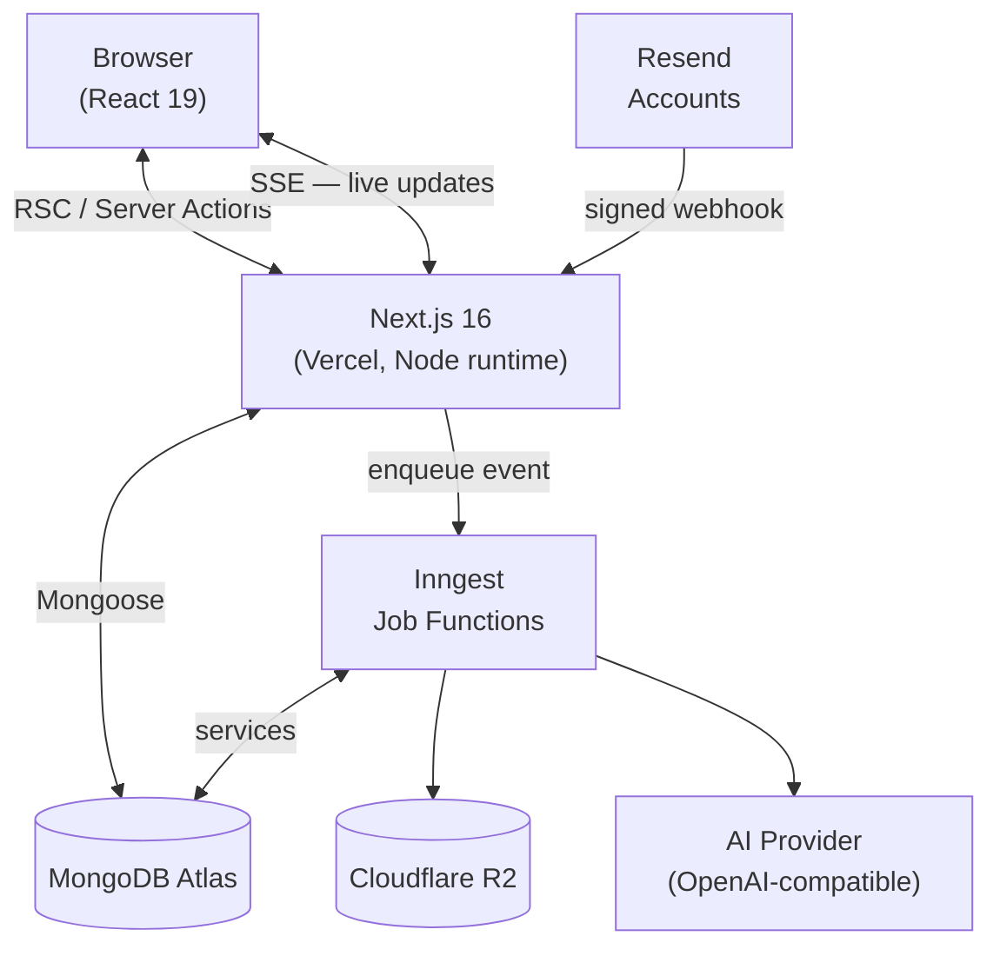

<div align="center">
  
  <h1>Wisemail</h1>
  <p><strong>The control room for every Resend account, domain, and inbox you run.</strong></p>

  [](LICENSE)
  [](https://nextjs.org)
  [](https://www.typescriptlang.org)
  [](https://www.mongodb.com)
  [](https://vercel.com)
</div>

---

## What it is

Most teams use Resend as nothing more than an API key and a `resend.emails.send()` call. Resend offers much more — inbound receiving, lifecycle webhooks, open/click tracking, broadcasts, contacts, automations, scheduled sends — but the features go unused, events are never kept, and multiple accounts have no unified view.

Wisemail connects to one or more Resend accounts with a full-access API key, auto-registers a webhook on each, stores every event and inbound message, and turns that into a team workspace:

- **Inbox** — threaded mail with attachments, read receipts on replies, and a composer across all accounts and domains (rich text, HTML with live preview, templates, schedule send)
- **Activity log** — searchable timeline per email, long-term history beyond Resend's 30-day window, per-recipient lookup
- **Insights and alerts** — bounce/complaint rates, deliverability trends, silence detection, DNS drift, and real-time notifications
- **Audience** — contacts, segments, topics, broadcasts, and templates across all connections, with analytics from stored events
- **AI assistance** — triage, reply drafts, compose helpers, and anomaly explanations (any OpenAI-compatible endpoint)
- **Housekeeping** — Trash, permanent delete, bulk cleanup rules, and a full audit log

All scoped to multi-tenant organizations, with roles (Owner / Admin / Developer / Support / Viewer) and project-level access for agencies.

## Tech stack

| Layer | Choice |
|---|---|
| Framework | Next.js 16 App Router, React 19, TypeScript (strict) |
| Styling | Tailwind CSS v4, CSS-variable design tokens, shadcn/ui |
| Motion | Motion (`motion/react`), NumberFlow for rolling counters |
| Auth | Better Auth with organization and invitation plugins |
| Database | MongoDB Atlas (replica set) via Mongoose |
| Jobs | Inngest — durable steps, retries, cron, per-connection throttle |
| Realtime | Server-Sent Events over a MongoDB change stream |
| Storage | Cloudflare R2 (private) — raw MIME, inbound and outbound attachments |
| Email | Resend SDK behind a single adapter module |
| AI | `openai` SDK against any OpenAI-compatible endpoint |
| Billing | Stripe (Better Auth plugin + direct SDK for metered overage and packs) |
| Testing | Vitest (unit + integration), Playwright (e2e) |
| Errors | Sentry (optional) |

Full stack rationale in [`docs/TRD.md`](docs/TRD.md).

## Architecture



**Key flows:**

- **Ingest hot path** — `POST /api/ingest/resend/[connectionId]` verifies the Svix signature, deduplicates, stores, and enqueues to Inngest; returns 200 in under 300 ms with no Resend API calls on the hot path.
- **Sync** — paged backfill of all Resend resources, checkpointed in `sync_runs` so timeouts resume at the failed stage.
- **Realtime** — every service write calls `publish()` into `realtime_events`; a change stream fans events to SSE clients subscribed to matching topics.

## Getting started

Requirements: **Node.js 24** (see `.nvmrc`), **pnpm**, and a `mongod` binary on `PATH` (or at `/opt/mongo/mongod`).

```bash
pnpm install
cp .env.example .env.local     # fill the Core block
pnpm db:dev                    # MongoDB replica set rs0 on 127.0.0.1:27017
pnpm dev                       # http://localhost:3000
```

#### Port 27017 already in use

If a system `mongod` (for example the `mongod` systemd service) already listens on 27017, it is usually a standalone instance without a replica set. `?replicaSet=rs0` then fails to connect, and `pnpm db:dev` skips starting because the port is busy. Run the project database on another port and point `.env.local` at it:

```bash
MONGO_PORT=27018 pnpm db:dev
# .env.local
MONGODB_URI=mongodb://127.0.0.1:27018/wisemail?replicaSet=rs0
```

Alternatively stop the system service (`sudo systemctl disable --now mongod`) and use the default port.

Jobs (sync, event processing, sending, alerts) run through Inngest. Start its dev server in a second terminal — no keys required:

```bash
npx inngest-cli@latest dev
```

Without it, jobs fall back to in-process execution in dev when the Inngest server is unreachable (`INNGEST_DEV=true`).

### Seed demo data

```bash
pnpm db:seed
```

Creates a platform admin and four demo workspaces (Free, Pro, Team, Agency) with users in every role, inbound mail, events, and 30 days of metrics. All accounts use password `wisemail-dev-123`. The script prints the full user table at the end. Safe to re-run; `--reset` drops the dev database first.

## Commands

| Command | Description |
|---|---|
| `pnpm dev` / `pnpm build` / `pnpm start` | Next.js dev, build (checks env first), start |
| `pnpm typecheck` | `next typegen` + `tsc --noEmit` |
| `pnpm lint` / `pnpm format` | ESLint / Prettier |
| `pnpm test` / `pnpm test:watch` | Vitest (unit and integration) |
| `pnpm test:e2e` | Playwright end-to-end |
| `pnpm db:dev` | Start local MongoDB replica set |
| `pnpm db:seed` | Seed demo workspaces and users (`--reset` drops the database first) |
| `pnpm webhook:test <connectionId>` | Post a signed test webhook to a connection |
| `pnpm mail:check` | Run the full mail flow against in-memory services |

Every change must pass `pnpm typecheck`, `pnpm lint`, `pnpm test`, and `pnpm build`.

## Configuration

`lib/env.ts` validates every variable with Zod at startup. `pnpm build` runs `scripts/check-env.ts` before the build; a misconfiguration fails the deployment before it goes live. Code never reads `process.env` directly.

### Core (always required)

| Variable | Notes |
|---|---|
| `MONGODB_URI` | `mongodb://127.0.0.1:27017/wisemail?replicaSet=rs0` locally (transactions need a replica set) |
| `BETTER_AUTH_SECRET` | 32+ characters — `openssl rand -base64 32` |
| `BETTER_AUTH_URL`, `APP_URL` | Public base URL; `http://localhost:3000` locally, `https://…` in production |
| `ENCRYPTION_KEK_CURRENT`, `ENCRYPTION_KEK_ID` | AES-256-GCM key-encrypting key and its ID (`openssl rand -base64 32`) |

### Service modes

All external services default to in-memory fakes in development and test:

| Variable | Dev default | Production |
|---|---|---|
| `RESEND_MODE` | `fake` | `live` + `SYSTEM_RESEND_API_KEY`, `SYSTEM_FROM_EMAIL` |
| `STORAGE_MODE` | `fake` | `r2` + R2 credentials |
| `AI_MODE` | `fake` | `live` + `AI_BASE_URL`, `AI_API_KEY`, `AI_MODEL` |
| `INNGEST_DEV` | `true` (local dev server) | `false` + `INNGEST_EVENT_KEY`, `INNGEST_SIGNING_KEY` |
| `BILLING_ENABLED` | `false` | `true` + Stripe keys and price ids |

See [`.env.example`](.env.example) for the full variable list with comments.

### Fake Resend keys

With `RESEND_MODE=fake`, keys follow `re_<team>[_<flag>]`. The same `<team>` slug is the same Resend account (used by the duplicate-connect check).

| Key | Behaviour |
|---|---|
| `re_acme_full` | Healthy full-access key, webhook registered, connection `active` |
| `re_acme_allgood` | All domains verified, tracking and receiving on — fully green checklist |
| `re_acme_sending` | Rejected: sending-only key |
| `re_acme_invalid` | Rejected by Resend |
| `re_acme_ratelimit` | Every call returns 429 |
| `re_acme_slotfull` | No free webhook slot; saves as `needs_attention` |
| `re_acme_manycontacts` | 230 contacts (pagination and checkpoint/resume testing) |

Dev outbox at `/dev/outbox`: system emails (verification links, invitations, digests) land there in fake mode instead of a real inbox.

## Testing

- **Unit and integration** (`tests/unit`, `tests/integration`): Vitest with `mongodb-memory-server`. Uses `/opt/mongo/mongod` when present. `*.test.tsx` runs in jsdom.
- **End-to-end** (`tests/e2e`): Playwright with Chromium. `pnpm test:e2e` starts a local Inngest server and Next.js on port 4200 with all services in fake mode. Specs create their own users and workspaces so they run in parallel.
- **Mail flow** (`pnpm mail:check`): runs the complete pipeline — sync, inbound MIME with attachments, reply, delivered/opened/clicked webhooks, read receipts — against in-memory services. No dev database needed.
- **CI** (`.github/workflows/ci.yml`): typecheck, lint, test, and build on every push and pull request; Playwright against a MongoDB replica set service.

## Platform admin

`/admin` is the operator panel, accessible only to Better Auth users with the `admin` role. Add your email to `PLATFORM_ADMIN_EMAILS` and sign in to gain access.

Features: user management (search, ban/unban, revoke sessions, impersonate), organization management (plan changes, limit overrides, trial controls, suspension), and read-only system health. Every write goes to `audit_logs` under `admin.*` events. Non-admins see a 404.

## Plans

| | Free | Pro ($12/mo) | Team ($39/mo) | Agency ($99/mo) |
|---|---|---|---|---|
| Event retention | 30 days | 180 days | 1 year | 2 years |
| Connections | 1 | 3 | 5 | 15 |
| Members | 3 | 10 | 25 | Unlimited |
| Alert rules | 3 | 20 | Unlimited | Unlimited |
| AI credits/month | — | 1,000 | 5,000 | 15,000 |
| Attachment storage | Resend-hosted | Cloudflare R2 | Cloudflare R2 | Cloudflare R2 |

Overage billed per extra tracked email. AI credit packs available ($5 / 1,000 credits). 14-day Pro trial — no card required. See [`docs/PRICING.md`](docs/PRICING.md) for the full metering and lifecycle rules.

## Project structure

```
app/          (auth), (app)/[orgSlug]/…, (admin)/admin, api/{auth,ingest,inngest,stream,v1,…}
components/   ui (shadcn + tokens), app shell, per-feature components
lib/          services, db models, Resend adapter, auth, billing, AI, realtime, storage, …
inngest/      job client and functions
emails/       React Email templates for system email
scripts/      check-env, dev-mongo, webhook:test, e2e-prepare, perf, seed
tests/        unit, integration, e2e
docs/         PRD, UCD, TRD, DBD, FED, PRICING, PLAN
```

Full tree with file descriptions in [`docs/TRD.md`](docs/TRD.md) §4.

## Docs

| File | Contents |
|---|---|
| [`docs/PRD.md`](docs/PRD.md) | Features, personas, and product decisions |
| [`docs/TRD.md`](docs/TRD.md) | Stack, architecture, security, data flow, project structure |
| [`docs/DBD.md`](docs/DBD.md) | Data model, indexes, and migration notes |
| [`docs/FED.md`](docs/FED.md) | Design system: tokens, typography, motion, Wizi |
| [`docs/PRICING.md`](docs/PRICING.md) | Plans, metering, and lifecycle rules |
| [`docs/PLAN.md`](docs/PLAN.md) | Phased build checklist and decision log |
| [`docs/UCD.md`](docs/UCD.md) | Use cases per persona |

## License

Copyright © 2026 M. Yousuf — proprietary software. No reuse without permission. See [LICENSE](LICENSE).
